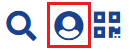
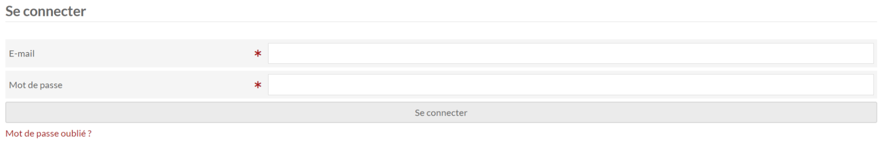
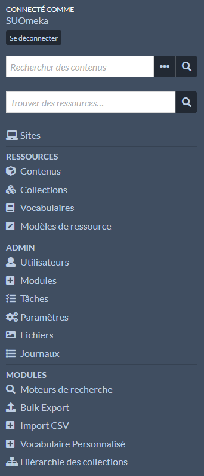

# Administration

## Se connecter

Cliquez sur l'icône du buste du personnage présent en haut à droite du site public.

Vous arrivez sur un formulaire pour saisir vos identifiants de connexion :

## Comprendre l'interface d'administration

Le menu latéral permet d'accéder à différentes fonctionnalités autour :

* Des sites : gestion des pages, association des ressources, paramétrages du thème, etc.
* Des ressources : contenus, collections, vocabulaires et modèles de ressources
* De l'administration du logiciel : utilisateurs, modules, paramétrages d'Omeka S, etc.
* Des modules : ceux présents dans le menu latéral ont des pages pour être configurés et/ou utilisés.

Des fonctionnalités du menu latéral possèdent des sous-menus qui permettent d'accéder à d'autres fonctionnalités.

Les fonctionnalités sont affichées et accessibles en fonction du rôle de l'utilisateur.
[Pour en savoir plus sur les rôles](https://omeka.org/s/docs/user-manual/admin/users/#roles-and-permissions).

Le contenu des pages de l'administration s'affichera sur la partie principale au centre.

Certaines fonctionnalités peuvent faire apparaître un menu latéral sur la droite. Dans la plupart des cas, ce menu latéral sont à valider avec un bouton en bas de celui-ci.