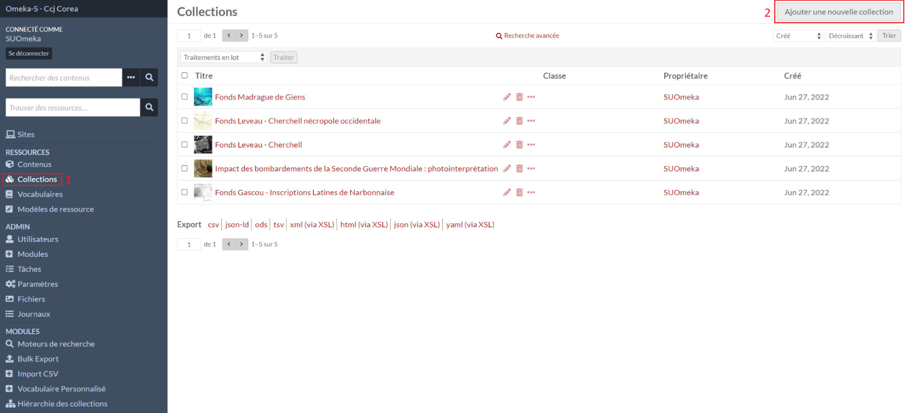
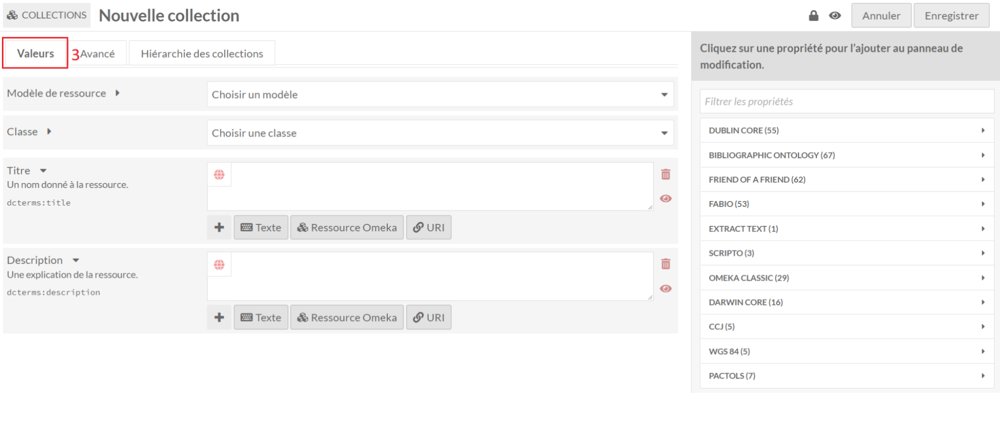
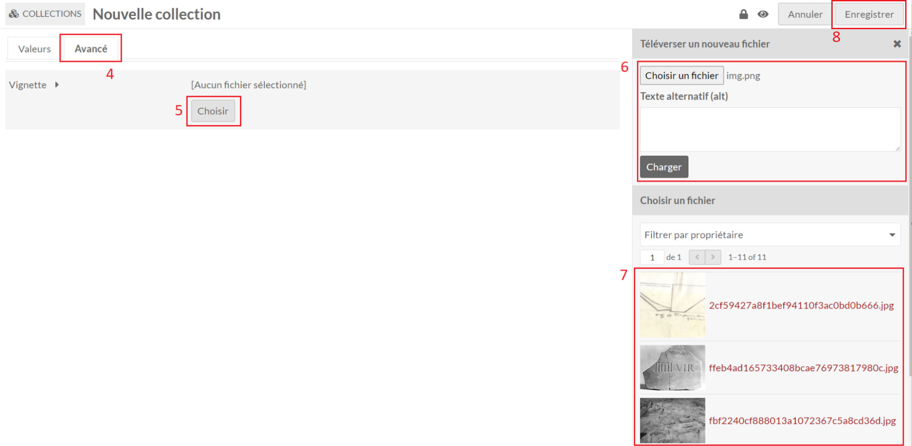
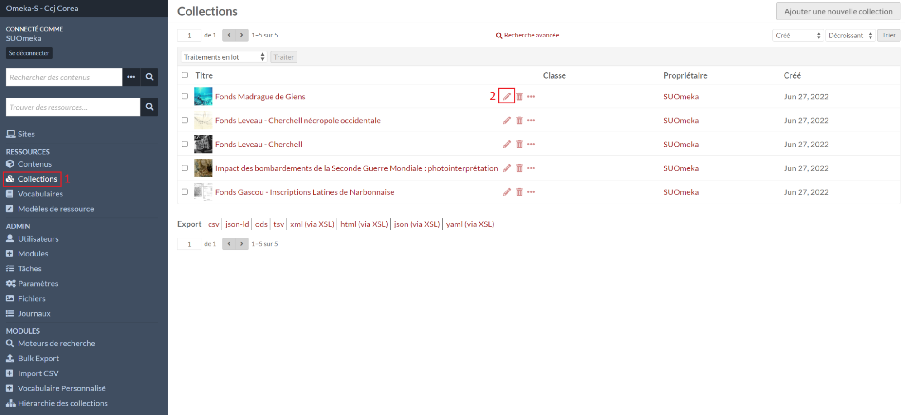

# Collections

## Créer une collection

Dans le menu **Collections** (1), le formulaire de création d’une collection est
accessible avec le bouton **Ajouter une nouvelle collection** (2).

### Métadonnées d'une collection

Dans l’onglet **Valeur** (3), on retrouve les propriétés décrivant la collection.

### Vignette d'une collection

Dans l’onglet **Avancé** (4), il est possible de **Choisir** (5) une image comme
vignette pour illustrer la collection dans les listes de ressources.

Une image peut être chargée (6) en choisissant une image avec l’explorateur de
fichiers qui s’ouvrira. Ou en sélectionnant une image parmi celles déjà chargées
dans Omeka S (7).

Le formulaire se valide avec le bouton **Enregistrer** (8).

## Éditer une collection

Dans le menu **Collections** (1), le formulaire d’édition d’une collection est
accessible avec l'icône stylo (2).
La page d’édition est la même que celle de [création](collections.md#créer-une-collection).