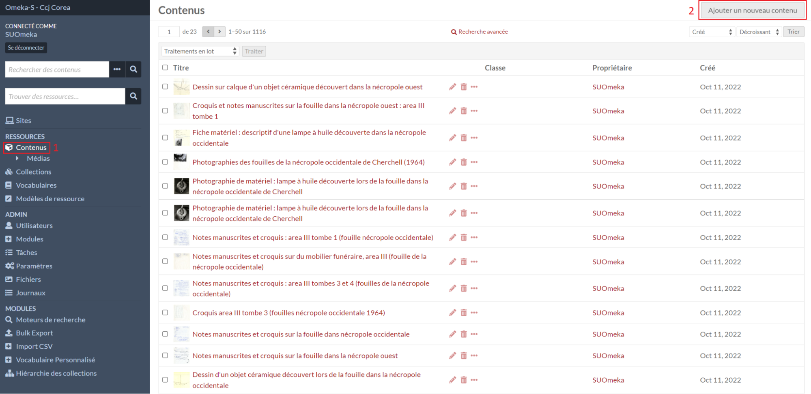
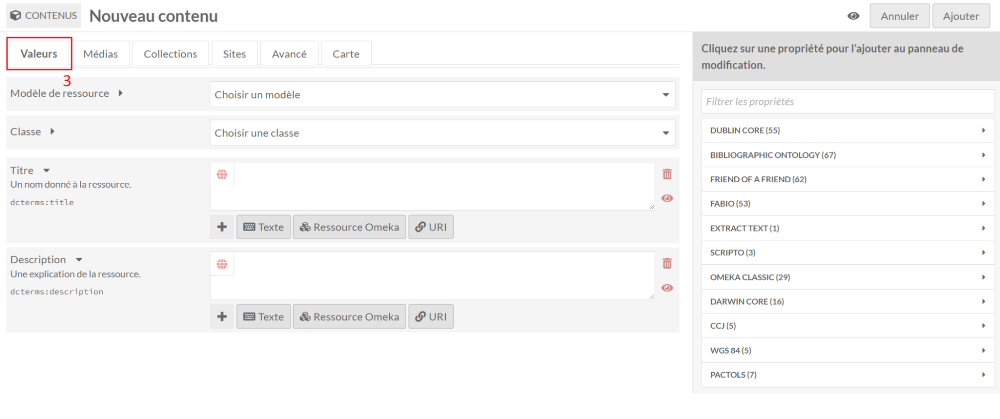
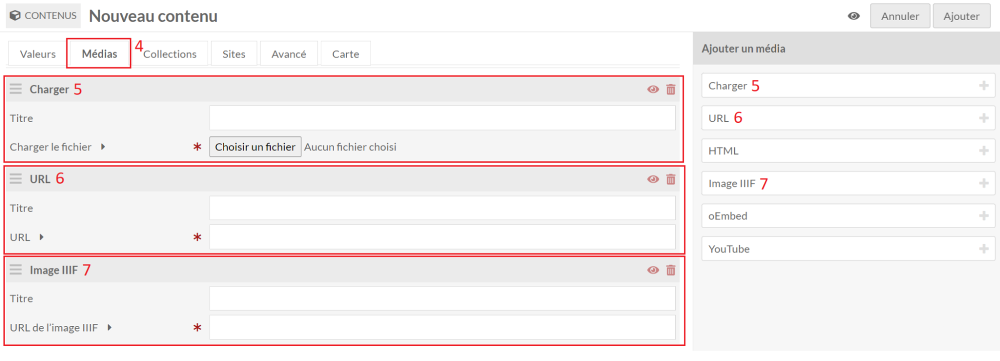
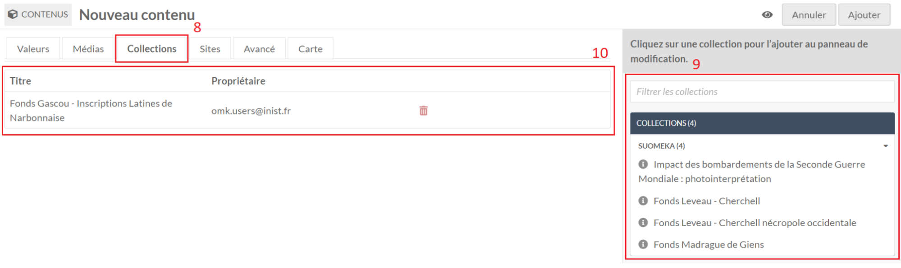
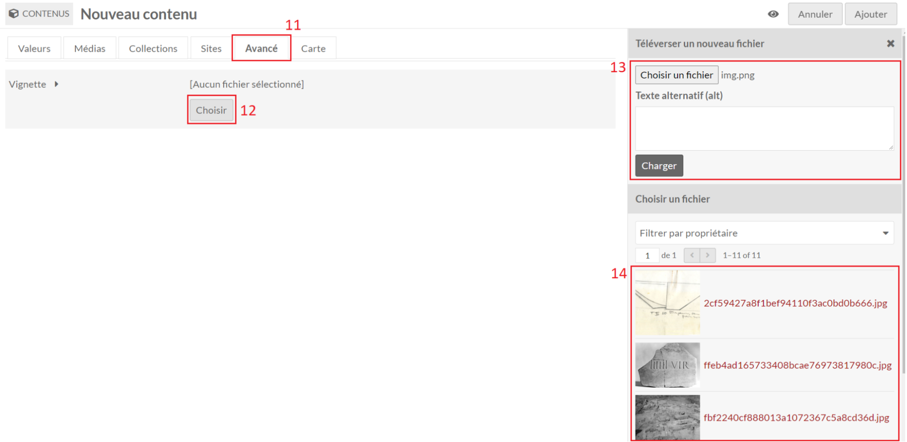
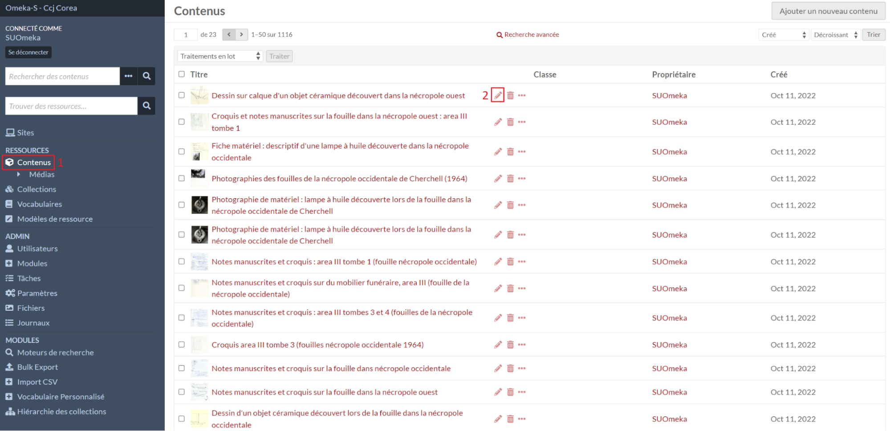

# Contenus

## Créer un contenu

Dans le menu **Contenus** (1), le formulaire de création d’un contenu est
accessible avec le bouton **Ajouter un nouveau contenu** (2).

### Métadonnées d'un contenu

Dans l’onglet **Valeurs** (3), on retrouve les propriétés décrivant le contenu.

### Médias d'un contenu

Dans l’onglet **Médias** (4), il est possible d’ajouter des médias (images, vidéos, etc.) provenant de différentes sources disponibles sur la droite: en local (5), depuis une url (6), depuis une url d’un serveur IIIF (7), etc.

Il est possible d'ajouter un titre lors de l'ajout d'un média et d'ordonnancer les médias avec le symbole en haut à gauche de chaque bloc en faisant un glisser/déposer.

Pour ajouter d'autres métadonnées aux médias, il faut [éditer un média](medias.md#editer-un-media).

### Collections d'un contenu

Dans l’onglet **Collections** (8), il est possible de sélectionner les collections
auxquelles rattacher le contenu.

La liste des collections disponibles est affichée à droite sous forme de menus
dépliables par utilisateurs (9).

La liste des collections rattachées au contenu apparaît sous les onglets (10).

### Vignette d'un contenu

Dans l’onglet **Avancé** (11), il est possible de **Choisir** (12) une image comme
vignette pour illustrer le contenu dans les listes de ressources.

Une image peut être chargée (13) en choisissant une image avec l’explorateur
de fichiers qui s’ouvrira. Ou en sélectionnant une image parmi celles déjà
chargées dans Omeka S (14).

Si aucune vignette n’est sélectionnée et si le contenu possède au moins un média, la vignette du premier média sera utilisée dans les listes de contenus et sur les cartes.

Dans l’onglet **Carte** (15), il est possible de géolocaliser un contenu de
différentes manières. (voir le module [Mapping](module-mapping.md))

## Éditer un contenu

Dans le menu **Contenus** (1), le formulaire d’édition d’un contenu est
accessible avec l'icône stylo (2).
La page d’édition est la même que celle de [création](contenus.md#créer-un-contenu).