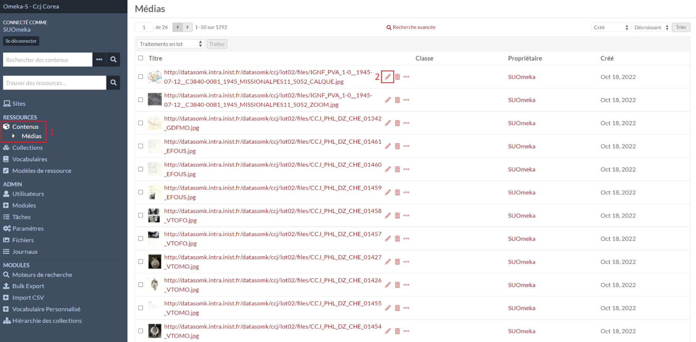

# Médias

La liste des médias est accessible en allant dans la liste des **Contenus**, puis le sous-menu **Médias** (1).

## Créer un média

Il n’est pas possible de créer un média avec un formulaire comme une
collection ou un contenu.

Il faut d’abord créer/éditer un contenu, puis aller dans l’onglet [**Médias**](contenus.md#médias-dun-contenu).

## Éditer un média

Dans le menu **Contenus**, puis le sous-menu **Médias** (1), le formulaire d’édition d’un média est accessible avec l'icône stylo (2).
La page d’édition est similaire à celle de [création/édition d’une ressource](ressources.md#formulaire-de-créationédition).