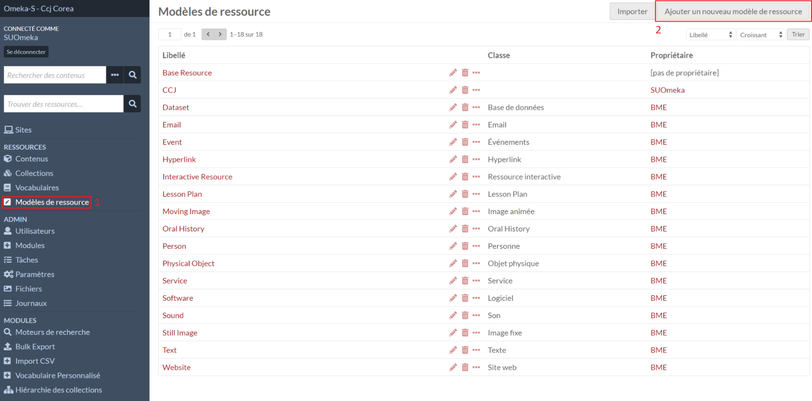
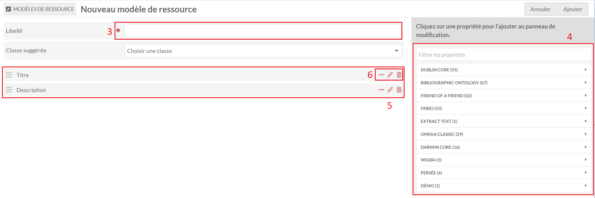
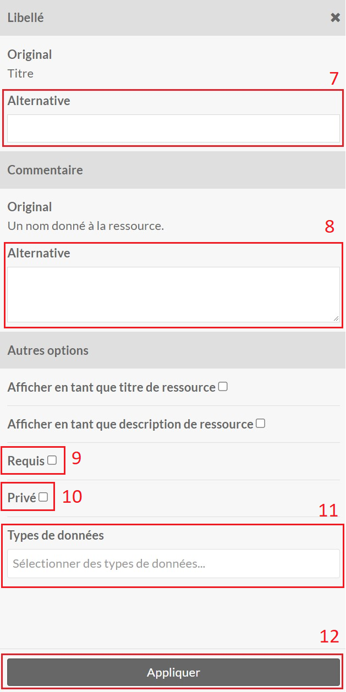
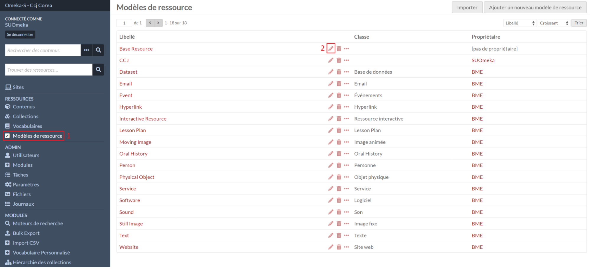

# Modèles de ressources

Un modèle de ressource est contitué de propriétés provenant d'un ou plusieurs [vocabulaires](vocabulaires.md).

Le modèle de ressource est le premier élément sélectionnable lors de la [création/édition d'une ressource](ressources.md#formulaire-de-créationédition) dans l'onglet **Avancée**.
Il permet de prédéfinir un liste de champs pour décrire les ressources et peut également servir de filtre lors des recherches.

## Créer un modèle

Dans le menu **Modèles de ressource** (1), le formulaire de création d’un modèle
est accessible avec le bouton **Ajouter un nouveau modèle** (2).

Un libellé est obligatoire (3).

La liste des propriétés est affichée à droite sous forme de menus dépliables par
vocabulaire (4).

Il est possible de chercher une propriété en saisissant le nom de la propriété
dans la zone de saisie. La recherche se fait dans la langue de l'administration.

Les propriétés du modèle apparaîtront à la suite du formulaire (5).

Pour chaque propriété (6), il est possible :

* d’accéder aux informations de celle-ci (icône 3 points)
* de paramétrer la propriété uniquement dans ce modèle de ressource (icône stylo)
* de la retirer du modèle de ressource (icône poubelle)

En cliquant sur l'icône stylo d'une propriété, un menu sur la droite s'ouvre.

Le titre alternatif (7) permet de modifier le nom de la propriété à l'affichage.

L'utilisation d'un libellé aternatif ne change l'affichage que lorsque le modèle est utilisé. Les paramétrages dans Omeka S, par exemple de l'instance Omeka S ou d'un site, n'en tiendront pas compte.

---

Le commentaire est affiché dans les formulaires de création/édition des ressources pour chaque propriété. Il permet de donner des indications sur la manière de les remplir (une norme à respecter, une manière d'écrire une valeur, etc.).

Le commentaire alternatif (8) permet de remplacer le commentaire d'origine uniquement dans ce modèle de ressource.

---

Le paramètre **Requis** (9) permet d'imposer d'avoir une valeur dans la propriété.

---

Le paramètre **Privé** (10) masquera la propriété lors de l'affichage des sites publics. Les valeurs renseignés dans ces champs seront automatiquement misent en privé lors de la création d'une ressource.

---

Le paramètre **Types de données** (11) permettent de sélectionner les types de valeurs qui peuvent être renseignés dans la propriété (par défaut : texte, uri et ressource) dans les formulaires de création/édition d'une ressource.

Plusieurs modules permettent d'ajouter des types pour avoir des vocabulaires personnalisés gérés dans Omeka S (Custom Vocab), l'utilisation de thésaurus (Value Suggest) ou l'éditorialisation en HTML (Data Type RDF)

---

**Ne pas oublier d’appliquer les modifications lors du paramétrage de chaque propriété (12).**

## Éditer un modèle

Dans le menu **Modèles de ressource** (1), le formulaire d’édition d’un modèle est
accessible avec l'icône stylo (2).

La page d’édition est la même que celle de [création](modeles-ressource.md#créer-un-modèle).

La modification du paramétrage d'une propriété d'un modèle ne va pas mettrent les valeurs des ressources utilisant ce modèle à jour. Cela nécessite des opérations supplémentaires.