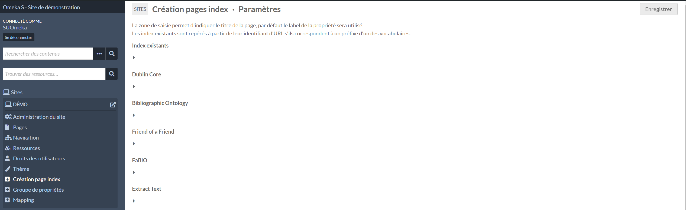
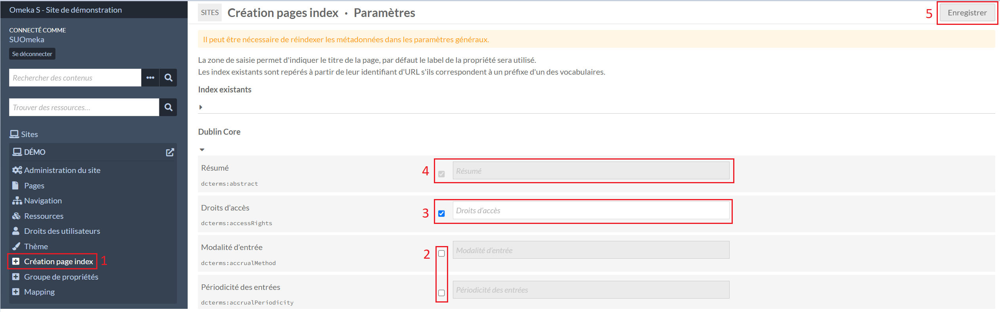

# Adm'Inist

Adm'Inist est un module pour rassembler des fonctionnalités qui ne nécessite par la création d'un module distinct (similaire au module [Next](https://github.com/Daniel-KM/Omeka-S-module-Next)).

## Création de page d'index (References)

Cette fonctionnalité permet uniquement de créer des pages d'index, cela ne permet pas de modifier ni supprimer une page.

Dans le sous menu d'un site, l'onglet **Création page index** (1) liste les propriétés triées par vocabulaires.

Pour sélectionner une page à créer, il faut cocher la case correspondante à la propriété (2). En cochant une case, la zone de saisie adjacente permet d'entrer un libellé qui sera utilisé comme titre de la page d'index qui sera créée, par défaut le libellé de la propriété sera utilisé.

Si une page dans le site, utilisant en identifiant pour l’URL la forme **prefixe-propriete** d'une propriété, sera considérée comme déjà existante et la case sera déjà cochée.

En validant avec le bouton **Enregistrer**, les pages sélectionnées seront crées.

!!! note
	Les pages créées par cette fonctionnalité seront construites avec ces éléments :
	
	- Un **titre**, en utilisant les libellés indiqués dans le formulaire, par défaut le libellé de la propriété sera utilisé
	- En **identifiant pour l’URL**, la forme **prefixe-propriete**, trouvable dans la [liste des propriétés d'un vocabulaire](vocabulaires.md#liste-des-proprietes-dun-vocabulaire), en remplaçant **:** par **-**
	- Un bloc **Titre de la page**
	- Un bloc **Référence** avec une configuration par défaut (sélection de la propriété, les raccourcis en début et fin de page et les totaux par valeur)

## Correspondances Solr (Advanced Search adapter for Solr)

Cette fonctionnalité permet uniquement de créer les correspondances pour Solr, cela ne permet pas de modifier ni supprimer une correspondance.