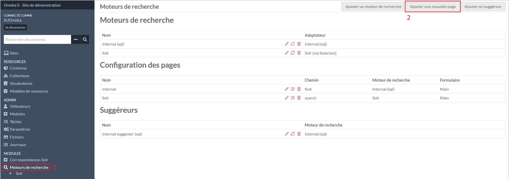
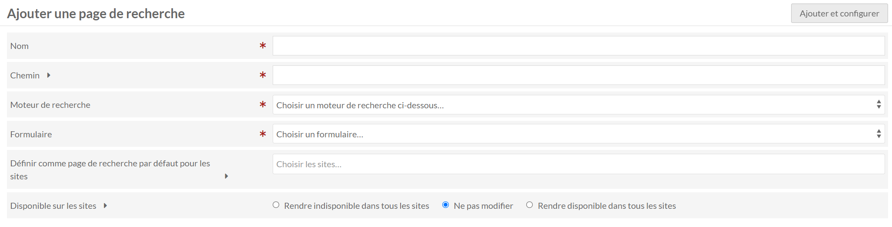
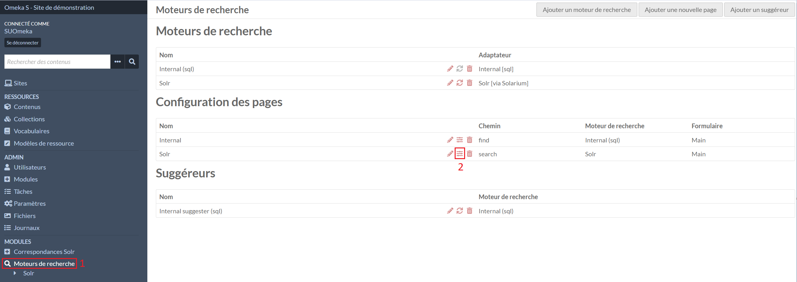
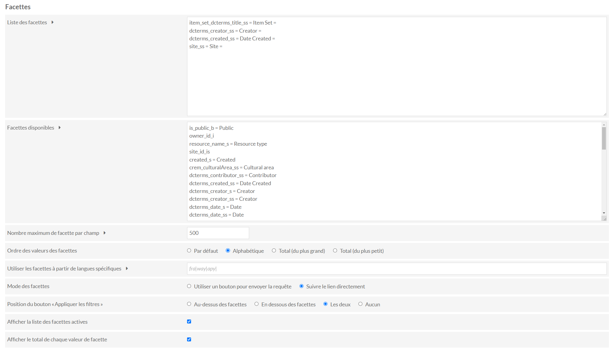
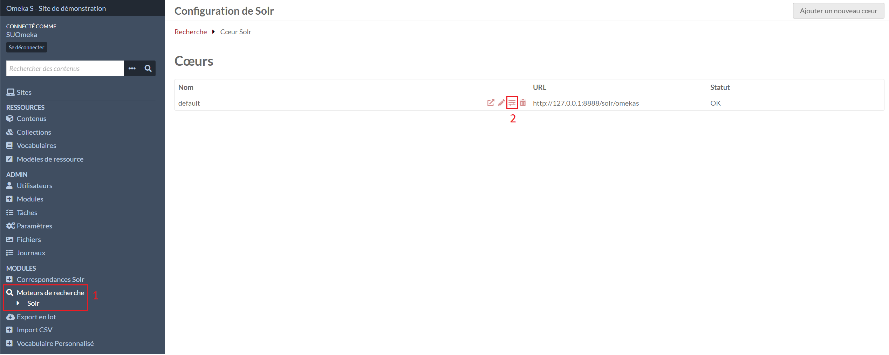
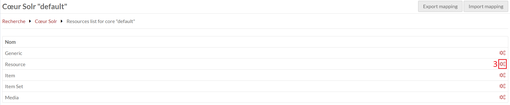
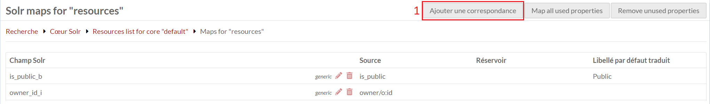
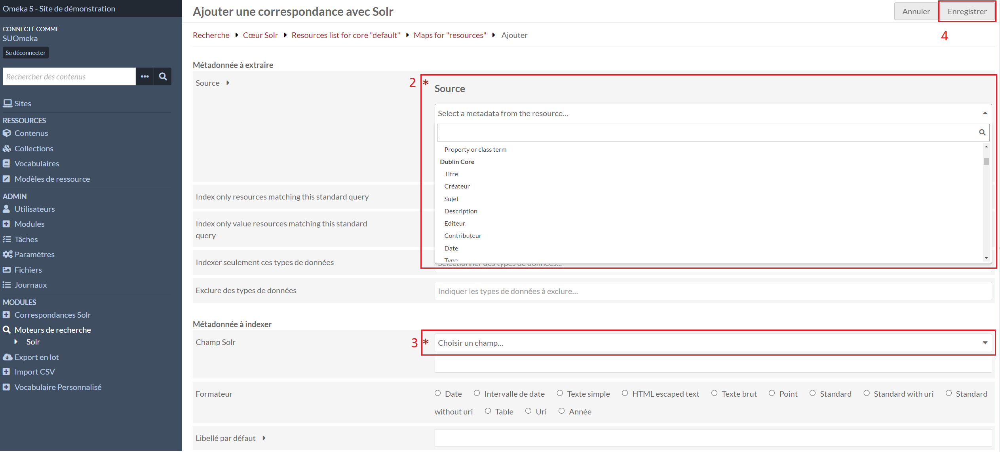
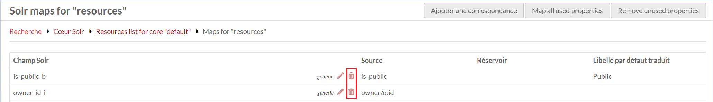

# Advanced Search

Et le module complémentaire Advanced Search adapter for Solr.

Ces modules permettent de mettre en place des pages de résultats de recherche pour les ressources.

## Créer une page de résultats

Dans l'onglet **Moteurs de recherche** (1), le deuxième bouton **Ajouter une nouvelle page** en haut à droite permet de créer une nouvelle page de résultats.

Dans le formulaire, il faut indiquer :

- un nom pour les affichages dans l'administration
- un chemin qui sera utiliser dans les urls
- **Solr (Solr [via Solarium])** en moteur de recherche
- **Principal** en formulaire

!!! attention
	La page de recherche doit être sélectionner dans les **Pages de recherche disponibles** dans les paramêtres des sites pour les utiliser et éviter des erreurs dans la configuration des sites

## Modifier une page de résultats

Dans l'onglet **Moteurs de recherche** (1), il faut cliquer sur le stylo de la page à modifier (2).

Le formulaire est le même que celui de la [création d'une page de résultats](module-advanced-search.md#creer-une-page-de-resultats).

## Configurer une page de résultats

Dans l'onglet **Moteurs de recherche** (1), il faut cliquer sur le deuxième icône de la page à configurer (2).

### Affichage des résultats

Dans la partie **Affichage des résultats**, il est possible de choisir où afficher certains éléments de la page de résultat.

### Tri

Dans la partie **Tri**, il y a deux listes de valeurs, la première contient les tris qui seront actifs dans la page de résultats.

Le libellé après le **=** sera utilisé pour les affichages.

Dans la deuxième liste se trouve les tris disponibles pour les copier dans la liste au-dessus.

!!! note
	Si **Advanced Search adapter for Solr** est utlisé, une correspondance **string (_s)** de l'élément sur lequel trier est nécessaire.

### Facettes

Les facettes sont les filtres de recherche disponibles à côté des résultats de recherche.

Dans la partie **Facettes**, il y a deux listes de valeurs, la première contient les facettes qui seront affichées dans la page de résultats.

Le libellé entre les **=** sera utilisé pour les affichages.

!!! note
	Si **Advanced Search adapter for Solr** est utlisé, une correspondance **strings (_ss)** de l'élément est nécessaire.

Dans la deuxième liste se trouve les facettes disponibles pour les copier dans la liste au-dessus.

L'**Ordre des valeurs des facettes** s'appliquent à toutes les facettes.

Le **Mode des facettes** permet de choisir comment l'utilisateur utilisera les facettes :

**Suivre le lien directement** : en cliquant sur un filtre, la page se rechargera en actualisant les résultats et les filtres sur lesquels il sera possible d'affiner la recherche.

**Utiliser un bouton pour envoyer la requête** : des cases à cocher seront disponibles en plus d'un bouton pour appliquer les filtres.

- Sélectionner deux valeurs d'un même ensemble de facettes s'appliqueront avec un **OU**.
- Sélectionner deux valeurs de deux ensembles de facettes distinct les appliqueront avec un **ET**.

---

## Correspondances Solr (Advanced Search adapter for Solr)

Les correspondances indiquent à Solr comment indexer chaque propriétés et/ou les informations des ressources.

### Liste des correspondances

Il faut accéder à la configuration de **Solr** dans le menu **Moteurs de recherche** (1), configurer le coeur (2), accéder à la gestion des correspondances des ressources (3).

Il est possible de créer plusieurs correspondances pour une même proprité ou information. Certains types de correspondances sont utilisés pour les tris ou les facettes des pages de résultats.

### Création d'une correspondance

!!! note
	Si **Adm'Inist** est installé voir : [Adm'Inist - Création des correspondances](module-administ.md#creation-des-correspondances-advanced-search-adapter-for-solr)

Il faut accéder à la [liste des correspondances](#liste-des-correspondances), il faut cliquer sur le 1er bouton **Ajouter une correspondance** en haut à droite (4).

Dans le formulaire, il faut sélectionner la propriété ou l'information (2) que Solr doit indexer et indiquer de quelle manière l'indexer (3) :

- ***_ss (strings)** pour les facettes, index, rebonds
- ***_s (string)** pour les tris
- ***_txt (text_general)** pour les textes

### Suppression d'une correspondance

Il faut accéder à la [liste des correspondances](#liste-des-correspondances), la suppression d'une correspondance se fait en cliquant sur la poubelle de celle-ci et en validant la fenêtre qui s'ouvre à droite.