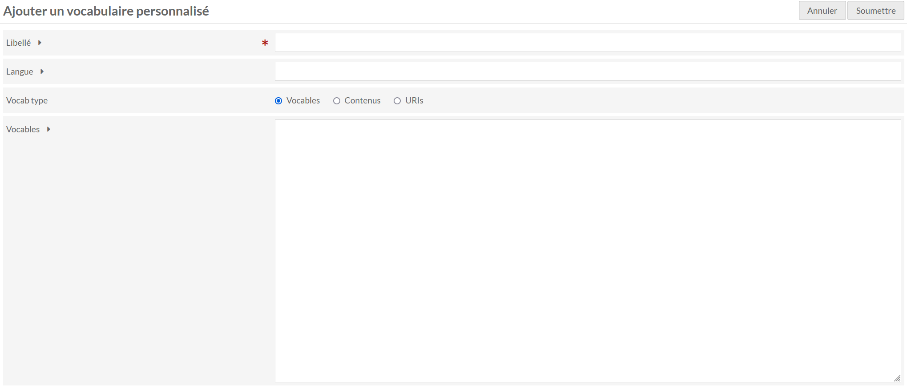

# Custom Vocab

Ce module permet d'éditer des listes controlées de valeurs pour être renseignées dans les types de données des propriétés des [modèles de ressources](modeles-ressource.md).

Une langue peut être indiqué pour que lors de l'édition d'une valeur d'une ressource, la langue soit automatiquement ajoutées.

Il est possible de créer des listes de litéraux, d'URI ou de contenus à partir d'une collection.

## Vocables

Le type "Vocables" permet de d'éditer une liste de texte. Chaque ligne correspond à une nouvelle valeur possible d'être renseignée.

L'ordre des valeurs correspondra à l'ordre affiché lors de l'édition des ressources utilisant ce vocabulaire personnalisé

## URI

Le type "URIs" permet de d'éditer une liste d'url. Chaque ligne correspond à une nouvelle valeur possible d'être renseignée.

L'ordre des valeurs correspondra à l'ordre affiché lors de l'édition des ressources utilisant ce vocabulaire personnalisé

Les valeurs doivent être renseignées sous la forme : url, un espace, le libellé (facultatif) pour les affichages.

## Contenus

Le type "Contenus" permet de sélectionner une liste de contenus à partir d'une collection présente dans Omeka S.

Les contenus proposés lors de l'édition d'une ressource seront triés par ordre croissant de leur identifiant interne dans Omeka S.