# Import CSV

Ce module permet de créer et modifier des ressources par lot en import des fichiers CSV ou TSV.

## Préparer un fichier à importer

Les fichiers à importer peuvent être préparer avec un tableur (Microsoft Excel, Libre Office Calc, etc.) et ensuite convertis dans un format compatible pour le module (CSV, TSV).

Il est conseillé de préparer un fichier par type de ressources à importer (collections, contenus, médias, etc.). Certains paramétrages lors de l'import sont spécifiques à un type de ressource.

!!! danger "Important"
	Il est nécessaire d'avoir **une ligne d'entête** dans le fichier.

	Le fichier a importé doit être encodé en **UTF-8**.

Si une ressource contient plusieurs valeurs pour une même propriété (par exemple deux créateurs), elles peuvent être séparées par un séparateur pour indiquer que c'est multivalué.

Lors d'un import, le module reconnait automatiquement les colonnes qui utilise la forme **prefixe:propriete** si les propriétés sont présentes dans les vocabulaires.

Les formes **prefixe:propriete** sont trouvables dans la [liste des propriétés d'un vocabulaire](vocabulaires.md#liste-des-proprietes-dun-vocabulaire).

## Importer un fichier

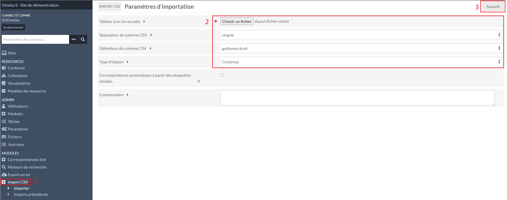

Dans le menu **Import CSV** (1), il faut sélectionner le fichier à importer, le séparateur de colonne (virgule si c'est un fichier CSV, tabulation si c'est un fichier TSV) et quelles types de ressources sont importées (2).

Le commentaire est facultatif, il sera affiché dans l'historique des imports.

Pour passer au paramétrage de chaque colonne, il faut cliquer sur **Suivant** (3).

---

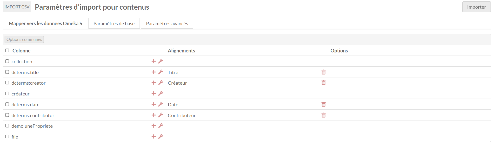

Dans le premier onglet **Mapper vers les données Omeka S**, pour chaque ligne est affichée : 

- une case à cocher pour appliquer des paramétrages à plusieurs ou toutes les colonnes
- l'entête de la colonne du fichier
- un plus pour indiquer un mappage manuellement
- une clé à molette pour ajouter des options
- vers quelle propriété ou informations sera mappée la colonne
- une poubelle pour supprimer le mappage
- les options appliquées

### Mapper vers les données Omeka S

En cliquant sur le plus d'une ligne, une fenêtre à droite s'ouvre. Certaines correspondances sont spécifiques à un import d'un type de ressource.

#### Propriétés

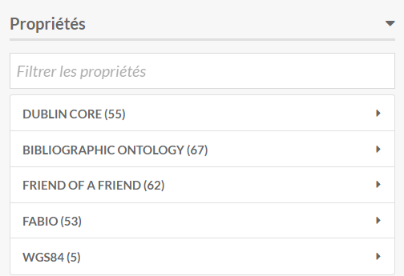

Dans **Propriétés**, il est possible de sélectionner manuellement dans quelles propriétés iront les valeurs de la colonne.

#### Métadonnée commune

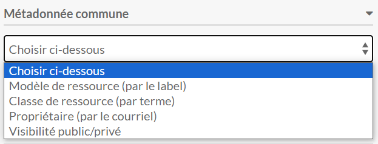

Dans **Métadonnée commune**, il est possible de sélectionner que la colonne sert à indiquer quel modèle de ressource, classe, propriétaire ou visibilité est à appliquer aux contenus.

Une colonne peut être ajoutée pour chacune de ces métadonnées communes.

#### Mappage spécifiques aux contenus

##### Données spécifiques au contenu

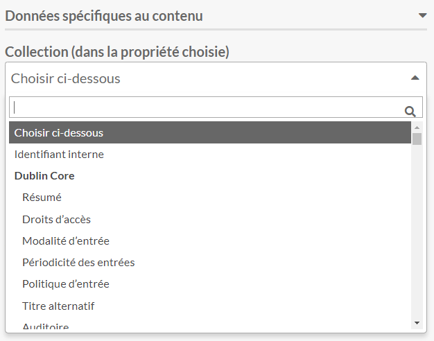

Lors d'un import de contenus, il est possible d'indiquer que les valeurs d'une colonne servent à associer un contenu à une collection en indiquant dans quelle propriété trouver les valeurs de la colonne.

##### Source du média

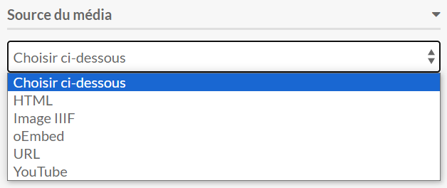

Dans **Source du média**, il est possible d'indiquer une image, un pdf, une vidéo ou autre type de média.

En appliquant une **Source du média** à une colonne d'un import de contenus, cela créera un média associé au contenu sans métadonnées.

Il faut créer une colonne par type de média dans le fichier importé.

##### Localisation de la ressource

!!! note
	Le module **Mapping** doit être installé.

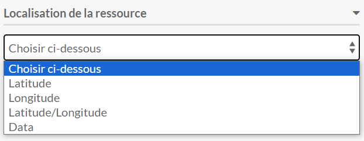

Il est possible d'ajouter une colonne dans le fichier pour indiquer des coordonnées géographiques au format **WGS84 décimal** (en remplaçant le séparateur **,** par **/**) en sélectionnant **Latitude/Longitude** qui ajouteront un marqueur sur une carte associée au contenu.

#### Mappage spécifiques aux médias

##### Données spécifiques au média

!!! danger "Important"
	Un média doit toujours être associé à un contenu.

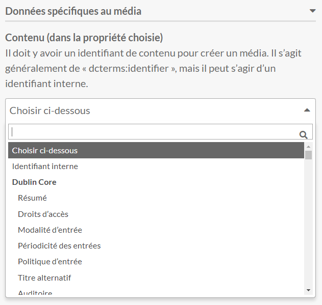

Lors d'un import de médias, il est nécessaire d'indiquer que les valeurs d'une colonne servent à associer un média à un contenu en indiquant dans quelle propriété trouver les valeurs de la colonne, sinon le média ne sera pas créé.

##### Source du média

!!! danger "Important"
	Un média doit toujours contenir une source.

Lors d'un import de médias, il est nécessaire d'indiquer que les valeurs d'une colonne servent à indiquer la source du média, sinon le média ne sera pas créé.

Si plusieurs médias sont à associer à un même contenu, il faut mettre une ligne par média dans le fichier importer

!!! note
	Pour simplifier les imports, il peut être nécessaire de faire un fichier par type de média à importer.

#### Options des colonnes

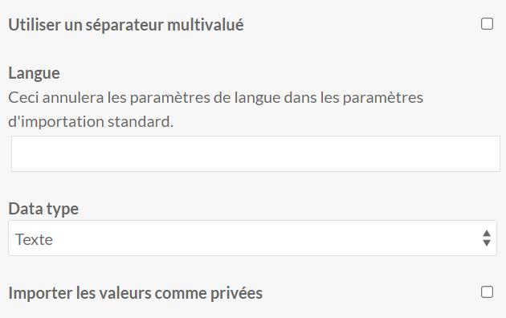

En cliquant sur la clé à molette, ou sur **Options communes** après avoir sélectionné au moins une colonne, il est possible d'indiquer : 

- que la colonne est multivalué
- une indication de langue
- un type de valeur
- la visibilité des valeurs

!!! note
	Si plusieurs options sont à appliquer pour une même colonne qui est mappé sur une propriétés, il est possible de doubler la colonne dans le fichier pour appliquer des options différentes.

	Exemple : si deux types de données sont à appliquer pour le créateur, il est possible de faire une colonne pour toutes les valeurs **Texte** et une pour toutes les valeurs **URI**.

### Paramètres de base

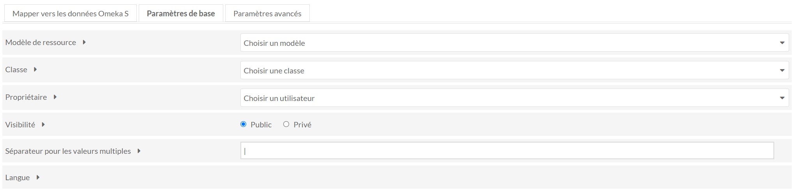

Dans l'onglet **Paramètres de base**, il est possible d'appliquer des paramètres qui s'appliqueront à toutes les ressources importées.

C'est dans cet onglet que le séparateur pour la multivaluation est à indiquer.

### Paramètres avancés

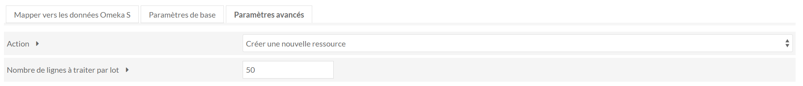

Pour les actions d'ajout, de correction et de mise à jour des métadonnées, il est nécessaire d'avoir une colonne avec un identifiant ou une valeur unique de la ressource à modifier.

Pour les actions d'ajout, de correction et de mise à jour des métadonnées des médias, les colonnes avec l'indication du contenu auquel associé et de la source du média ne sont pas nécessaires.

## Imports précédents

Dans le sous-menu **Imports précédents** de **Import CSV** sont listés les imports précédents faits.

Les détails des paramètres de chaque import sont disponibles en cliquant sur **Détails de la tâche**.

Le **journal** de chaque import fourni des informations sur le succès ou les erreurs rencontrés lors des imports.

Il est possible de défaire un import en cochant la case en début de ligne et en cliquant sur **Soumettre** en haut à droite.

Il n'est possible de défaire que les imports qui ont créés des ressources, il n'est pas possible de défaire un import qui a mis à jour des ressources.