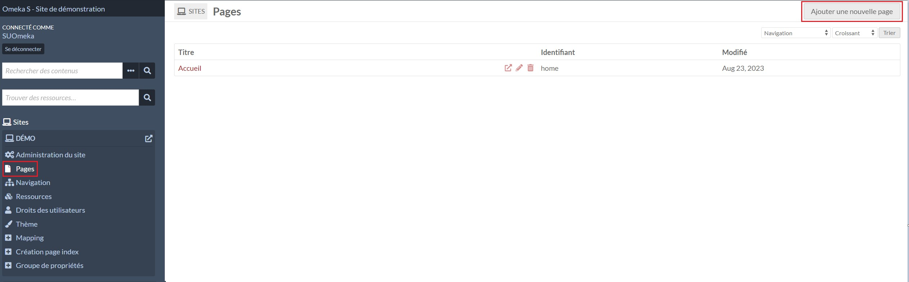
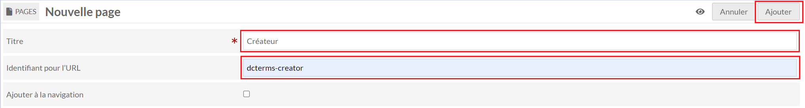
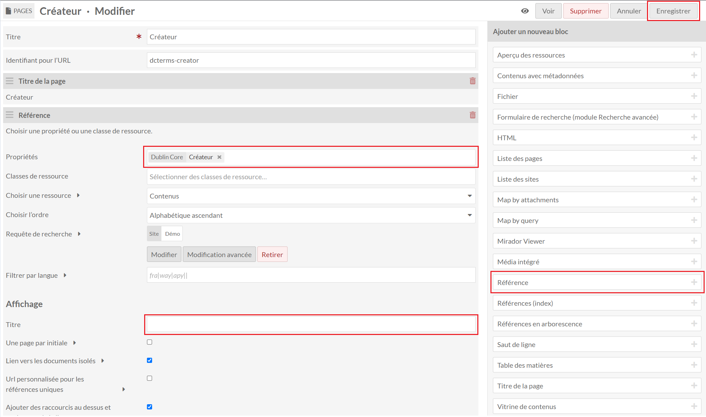
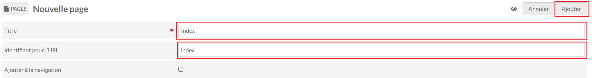
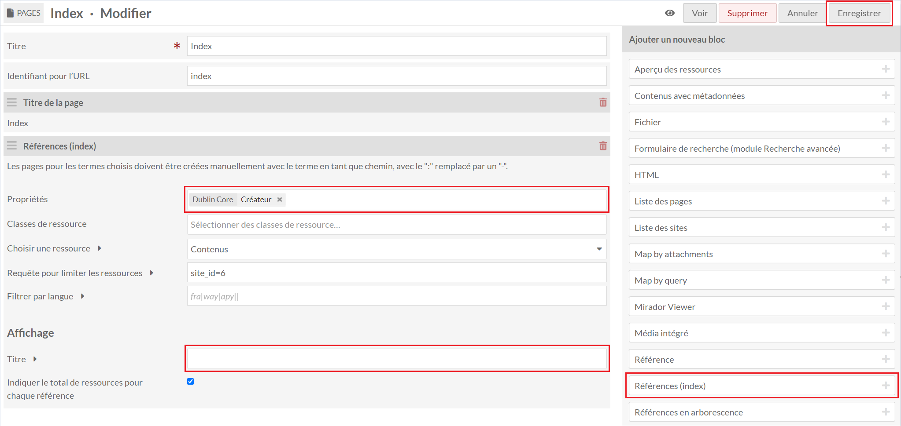
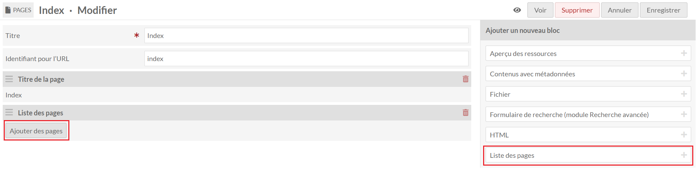
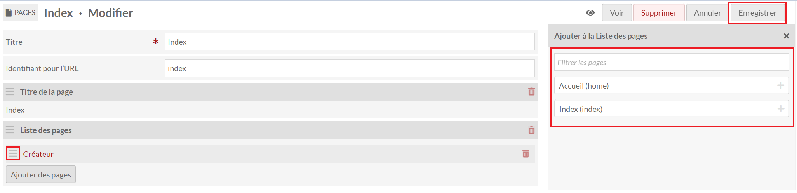

# References

Le module References permet de créer des pages d'index avec les la liste des valeurs distinctes d'une propriété des ressources associées aux sites.

## Créer une page index

Il faut dans un premier temps créer une nouvelle page dans le site concerné.

Le champ **Titre** est libre. Pour le champ **Identifiant de l'URL**, il faut indiquer la forme "prefixe:propriété" en remplaçant ":" par "-".

Par exemple: pour la propriété Dublin Core Creator → dcterms-creator.

Il faut utiliser le bloc **Référence** dans la liste à droite. Un bloc supplémentaire apparaîtra à la suite du titre de la page.

Dans le bloc, il faut sélectionner la propriété à utiliser pour l'index et retirer le titre par défaut dans la partie **Affichage**.

Il peut être nécessaire d'actualiser la page si le paramètre "Propriétés" ne s'affiche pas correctement avec le bouton en haut **Enregistrer** en haut à droite.

## Créer la liste d'index

Il faut dans un premier temps créer une nouvelle page dans le site concerné.

Le champ **Titre** est libre. Pour le champ **Identifiant de l'URL**, il faut indiquer "index".

Il existe plusieurs manières de créer la liste des index avec différents blocs.

### Avec le bloc Références

Dans le bloc, il faut sélectionner les propriétés à lister et retirer le titre par défaut dans la partie **Affichage**.

Les liens générés par ce bloc auront un suffixe avec le nombre de valeurs distinctes entre parenthèses et seront triés par ordre alphabétique de la forme "préfixe:propriété" des propriétés.

Il peut être nécessaire d'actualiser la page si le paramètre "Propriétés" ne s'affiche pas correctement avec le bouton en haut **Enregistrer** en haut à droite.

### Avec le bloc Liste des pages

Dans le bloc, il faut sélectionner les pages d'index à lister en cliquant sur **Ajouter des pages**.

Dans la fenêtre s'ouvrant sur la droite, il faut sélectionner les pages à lister.
Il est possible d'ordonnancer les pages sélectionnées en faisant un glisser/déposer avec l'icône présent à côté des titres des pages.

Les liens générés par ce bloc auront uniquement le titre de la page de cliquable.