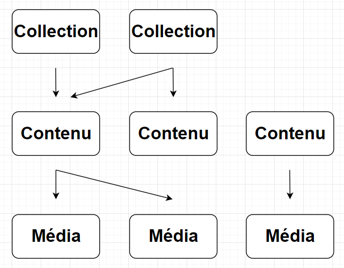

# Ressources

Une ressource est le terme utilisé par Omeka S pour définir une collection, un contenu ou un média.

Une collection peut contenir des contenus. Certaines fonctionnalités dans l'administration utilise cette notion (par exemple : les filtres de recherche).

Un contenu peut être associé à aucune ou plusieurs collections.
Un contenu peut contenir aucun ou plusieurs médias.

Un média est toujours associé à un seul contenu. C'est la ressource utilisée pour associer un fichier (image, pdf, vidéo, etc.).

## Formulaire de création/édition

Le formulaire de création/édition d’une ressource se présente sous cette
forme :
1. Un menu d’onglets qui varie en fonction du type de ressource et des modules installés
2. La sélection d’un modèle de ressource
3. La liste des propriétés utilisables triés par vocabulaires
4. La liste des propriétés décrivant la ressource
5. Les valeurs d’une propriété, une propriété peut être multivaluée.

Une valeur peut contenir du texte, une uri ou un lien vers une autre
ressource de la plateforme.

Une ressource doit contenir au moins un titre (dcterms:title), sinon elle
apparaîtra avec la valeur **[Sans titre]** par défaut.

La sélection d’un modèle de ressource (2) fera apparaître une liste prédéfinie des propriétés sans valeurs (4).