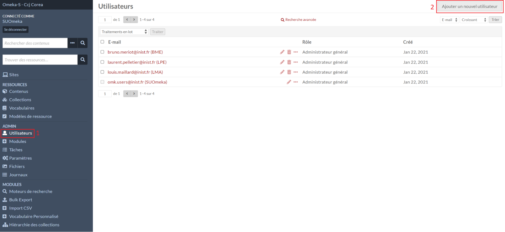
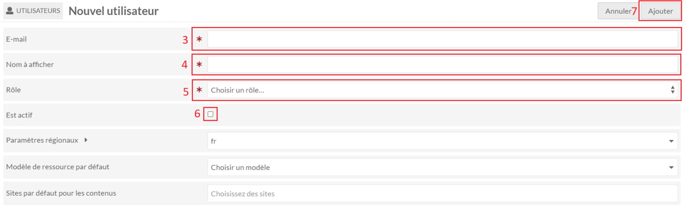

# Utilisateurs

## Créer un utilisateur

Dans le menu **Utilisateurs** (1), le formulaire de création d’un utilisateur est
accessible avec le bouton **Ajouter un nouvel utilisateur** (2).

L’e-mail (3) est utilisé comme identifiant de connexion.
Le nom à afficher (4) est utilisé dans différentes pages de l’administration.

[Pour en savoir plus sur les rôles](https://omeka.org/s/docs/user-manual/admin/users/#roles-and-permissions) (5).

Ne pas oublier de cocher pour rendre le compte actif (6).

Le formulaire se valide avec le bouton **Ajouter** (7).

Un e-mail sera envoyé avec un lien afin de créer un mot de passe. Vérifier vos spams s’il n’apparaît pas dans votre boîte de réception.