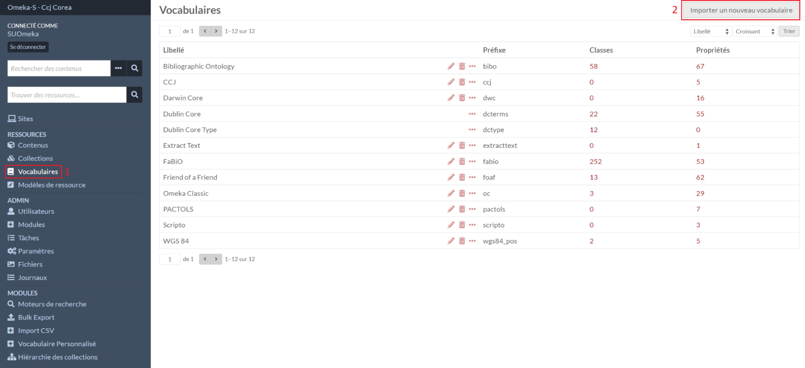
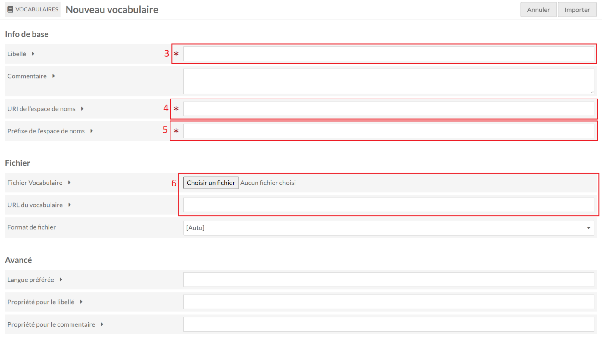
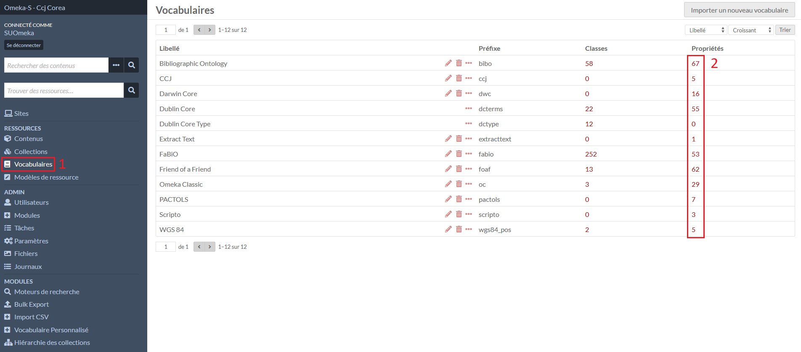
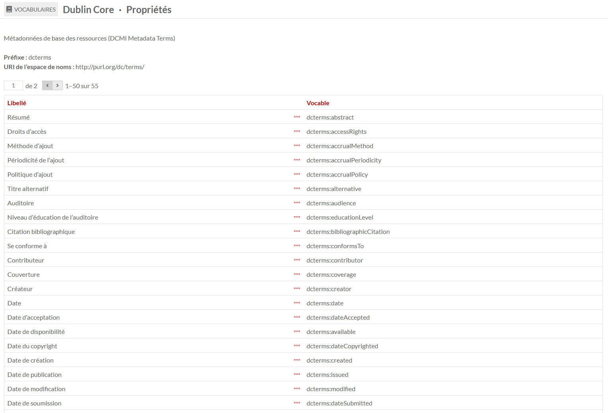
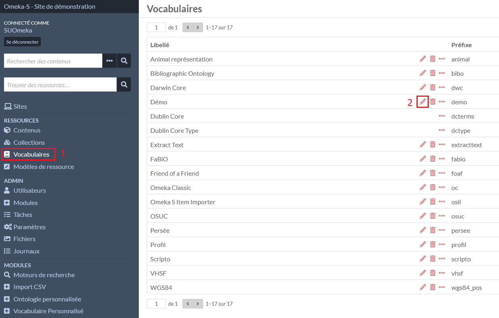
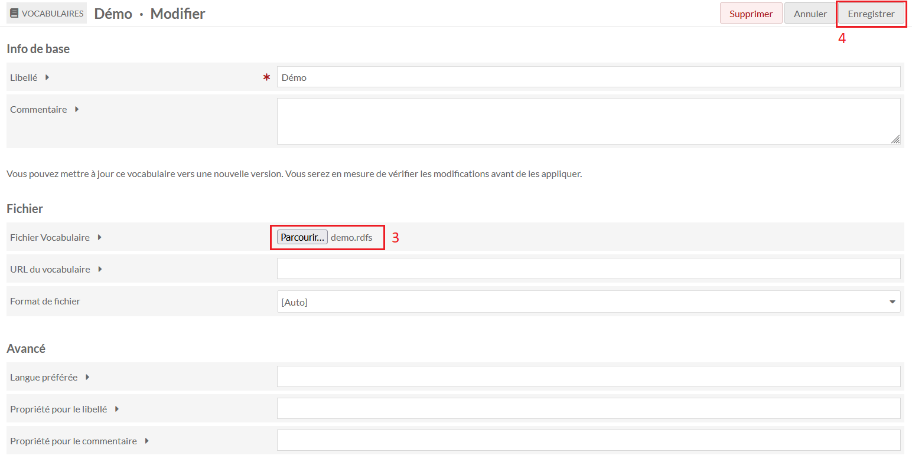
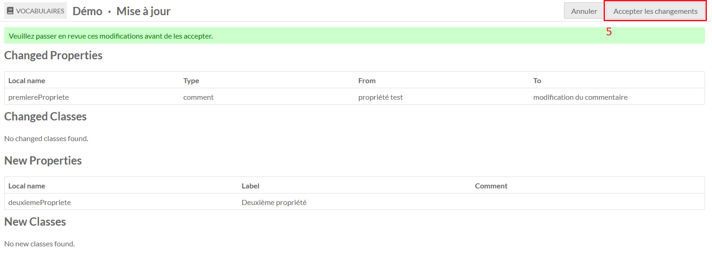

# Vocabulaires

Un vocabulaire contient une liste de propriétés à partir de laquelle les modèles de ressources sont constitués.

Par défaut, des vocabulaires sont déjà présents dans Omeka S : Bibliographic
Ontology, Dublin Core, Friend of a Friend, etc.

Il est également possible d’ajouter des vocabulaires (exemple : Darwin Core, Pactols) ou d’en créer avec des propriétés personnalisées.

## Préparer un vocabulaire

Il doit se créer dans un fichier nommé avec l'extension **.rdfs**. Il est composé d'une entête :

```ttl
#--------------------
# Commentaire libre
#--------------------

@prefix rdf: <http://www.w3.org/1999/02/22-rdf-syntax-ns#> .
@prefix dcterms: <http://purl.org/dc/terms/> .
@prefix rdfs: <http://www.w3.org/2000/01/rdf-schema#> .
@prefix xsd: <http://www.w3.org/2001/XMLSchema#> .

<http://www.w3.org>
	dcterms:modified "2012-06-14"^^xsd:date ;
	dcterms:publisher <http://purl.org/dc/aboutdcmi#DCMI> ;
	dcterms:title "DCMI Metadata Terms - other"@en .
```

Et chaque propriété est décrite sous cette forme :

- la forme [camel case](https://fr.wikipedia.org/wiki/Camel_case) du label entre <>
- un commentaire (facultatif) qui sera utilisé dans les formulaires de création/édition des ressources
- un label pour les affichages

```ttl
<unePropriete> a rdf:Property ;
	rdfs:comment "Un commentaire (facultatif)"@en ;
 	rdfs:label "Une propriété"@en ;
 	rdfs:range rdfs:Literal .
```

## Importer un vocabulaire




Dans le menu **Vocabulaires** (1), le formulaire de création d’un contenu est
accessible avec le bouton **Importer un nouveau vocabulaire** (2).

Le libellé (3) sert pour les affichages.

Pour l’URI de l’espace de noms (4), il faut indiquer l’url du site suivi du préfixe du vocabulaires.

Exemple : https://demo-s-intg.inist.fr/demo/

Le préfixe (5) est afficher avant la propriété pour indiquer à quel vocabulaire elle appartient.

Exemples : **dcterms** pour Dublin Core, **foaf** pour Friend of a Friend, etc.

La dernière information à fournir est une source pour la liste des propriétés à
ajouter, soit avec un fichier, soit une url.

## Liste des propriétés d’un vocabulaire




Dans le menu **Vocabulaires** (1), la liste des propriétés d’un vocabulaire est accessible en cliquant sur le nombre de propriétés d'un vocabulaires (2).

La liste comporte deux colonnes, le libellé utilisé pour les affichages et la propriété sous la forme “prefixe:propriete” utilisée par certains paramétrages et modules.

## Éditer un vocabulaire

La modification d’un vocabulaire se fait par un import d’un fichier **.rdfs**.





Dans le menu **Vocabulaires** (1), la modification d’un vocabulaire est accessible en cliquant sur le **stylo** d'un vocabulaires (2).

Dans la première page de la modification, il faut indiquer le fichier **.rdfs** (3).

Dans la deuxième page, avant la validation, Omeka S fourni un récapitulatif des ajouts et modifications détectées.

Il n’est pas possible de supprimer un champ d’un vocabulaire.